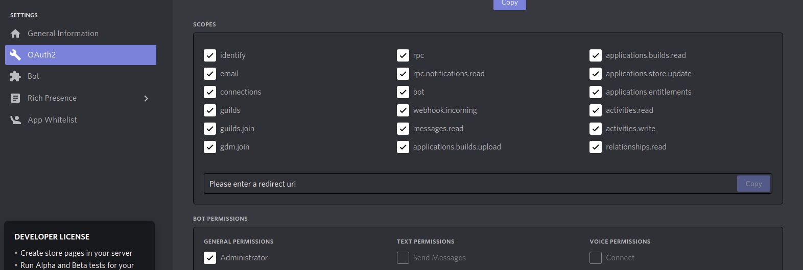
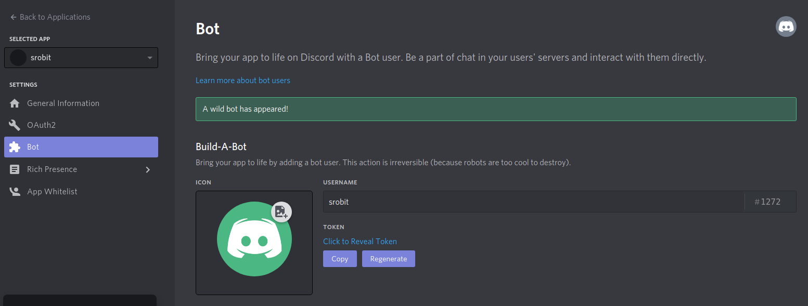
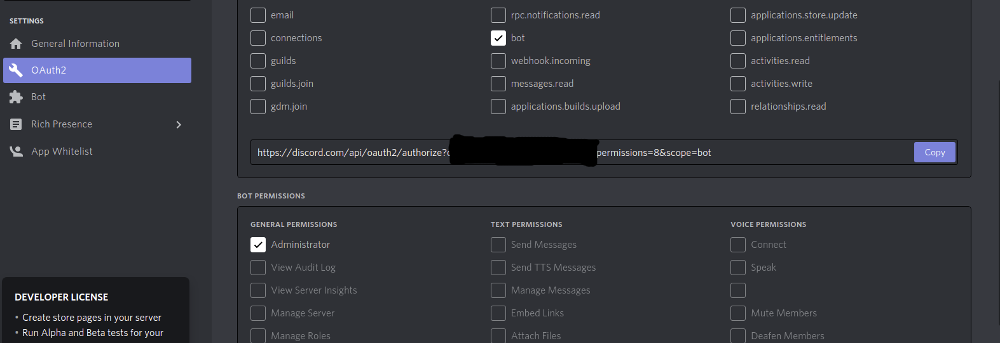
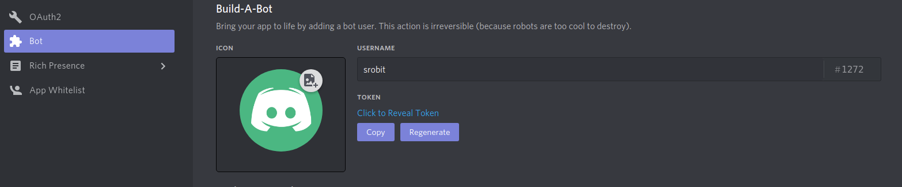
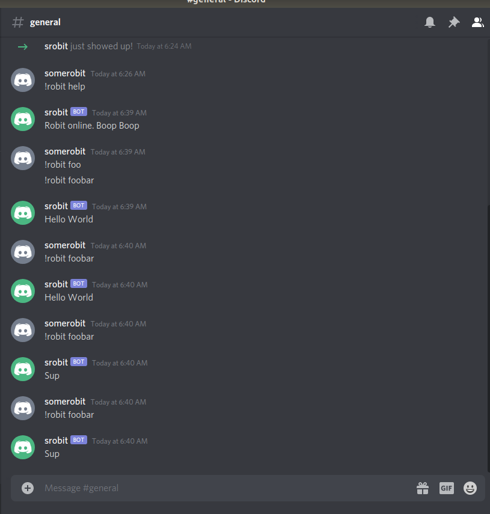

# Installation
Robit can either be installed by cloning the source from github and running the application locally using node, or it can be installed and run using docker.

## Configuration

### Create a bot account in discord

1. Login to discord using [discords website](https://discord.com/new).
2. Navigate to the developer portal [applications](https://discord.com/developers/applications).
3. Create a new Application.

4. Give that application a name.
5. Navigate to OAuth2.
6. Give bot full permissions. (at some point I will audit this)

7. Click Bot and add a bot.

8. Give the Bot administrator permissions. (at some point I will audit this)
9. Go to OAuth2 setting page.
10. Enable bot checkbox in scopes.
11. Give bot Administrator permissions. (at some point I will audit this)

12. Copy Bot URL and open it in a new browser window.
13. Select the server you would like to add the bot to and press continue followed by authorize.

### Setup your configuration

In order to configure your bot you will need the bot token created in the create bot account step. In order to get back to this you can go the the discord developer site, choose your bot application, and press the bot item in the sidebar. For this page you should be able to copy the bot token.



The easiest way to do this would be to use [this site](http://ilusr.com/robit/) to generate a config file. However you can generate one manually.

The end result should be a JSON file that looks similar to this.

```json
{
    "greeting": "Robit online. Boop Boop",
    "audioSources": [],
    "access": {
        "default": ["*"],
        "users": [],
        "deniedMessage": "You do not have the rights to perform this action"
    },
    "deferredactions" :[],
    "actions": [
        {
            "id": "test",
            "action": {
                "type": "broadcast",
                "message": "Hello World",
                "help": "Sends a hello world message"
            }
        },
        {
            "id": "foobar",
            "action": {
                "type": "broadcastrandom",
                "messages": ["Hello World", "Sup", "Testing"]
            },
            "type": "randombroadcast"
        }
    ],
    "token": "<Bot Token Goes here>"
}
```

## Running

This can be run using nodejs. In the case of nodejs you should be able to use the bundled javascript file and the configuration file and run a command like this.

`node dist/bundle.js config.json`

Once robit is online it should send a greeting message and you should be able to issue commands to robit.

